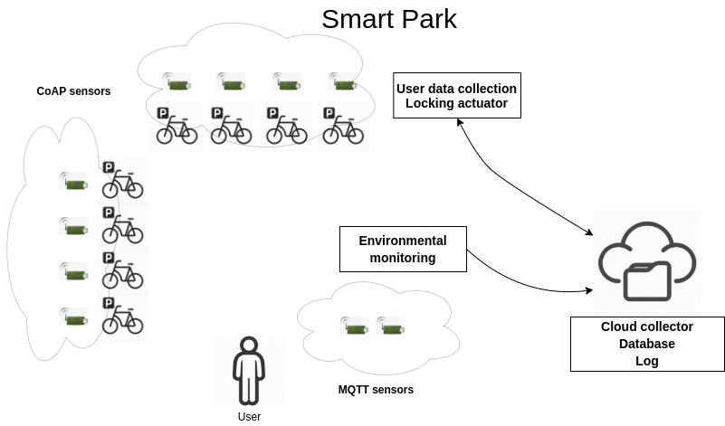
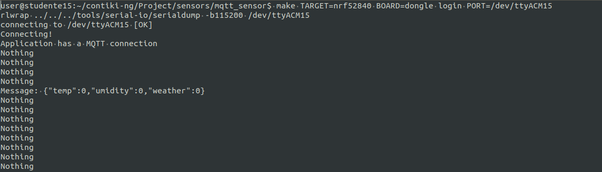
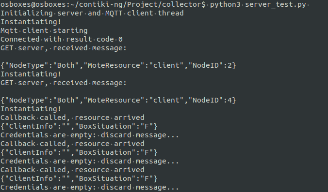
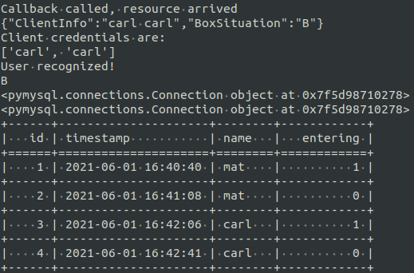
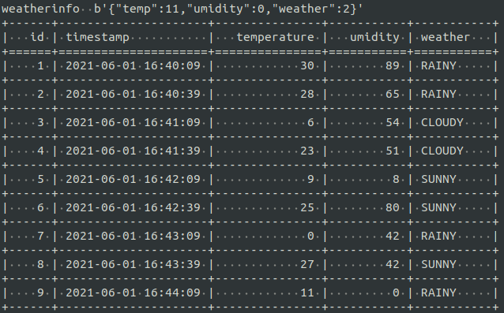

# SmartPark
Implementation of a SmartPark for bicycles for IoT project. The general schema is showed here, refeer to the presentation in order to have more clear ideas.


## Initial settings
In order to execute the sensors and the cooja simulation, contikier is needed. 
To run the collector, python3 and the following packages are required:
```
python3 -m pip install PyMySQL
python3 -m pip install tabulate
pip install CoAPthon
```
I suggest to clone this repository into the folder *contiki-ng* of your OS, in order to have the contiki path inside the Makefile of the sensors agree.

## Reproduce the simulation
To reproduce the simulation, you need to run both a local simulation on cooja with coapsensors, and a remote simulation with real sensors on the IoT testbed.
Before starting the simulation on cooja, move into another workspace and connect with three different terminals to the remote testbed, one of them forwarding the local port 1883 (to allow our mqtt client inside the collector to access the broker).
As soon as you are in, you need to copy the *rpl-border-router* and the *mqtt-sensor* of *sensors* folder to the remote testbed, modifying both the *project-conf.h* with
```
#define IEEE802154_CONF_PANID 0x00XX
```
where XX is your corresponding assigned sensor. In addition, you need to add the following line to */etc/mosquitto/mosquitto.conf*
```
listener 1883 localhost
```
in order to reach the mosquitto broker from your OS. Finally, you can deploy the border router, launch the mosquitto broker and the mqtt-client with the following commands, using the 3 terminals mentioned before.
Terminal 1:
```
cd contiki-ng/SmartPark/sensors/rpl-border-router
make TARGET=nrf52840 BOARD=dongle border-router.dfu-upload PORT=/dev/ttyACM67
make TARGET=nrf52840 BOARD=dongle connect-router PORT=/dev/ttyACM67
```
Terminal 2:
```
sudo mosquitto -c /etc/mosquitto/mosquitto.conf
```
Terminal 3:
```
cd contiki-ng/SmartPark/sensors/mqtt-sensor
make TARGET=nrf52840 BOARD=dongle mqtt-client.dfu-upload PORT=/dev/ttyACM15
make TARGET=nrf52840 BOARD=dongle login PORT=/dev/ttyACM15
```

Then after the mqtt-client is connected to the MQTT broker and start publishing messages, log into contikier and launch cooja:
```
contikier
cd tools/cooja
ant run
```
Then start a new simulation. You need to deploy before the border-router, inside the folder *sensors*, connect the Serial Socket server through cooja and then you can start the simulation. Open a terminal, go into the folder of the *rpl-border-router* and launch:
```
make TARGET=cooja connect-router-cooja
```
to launch the tunslip6.
Then you can start adding lock sensors into the simulation. In the meantime, open another terminal, go into the folder *collector* and launch the collector with
```
python3 server_test.py
```
Collector now will start registering the just mentioned *lock* sensors receiving updates on the current situation and acting on them. In the meantime, an MQTT client connects to the broker (through the port forwarding) and start receiving updates about weather situation.

Some screen are showed below:




